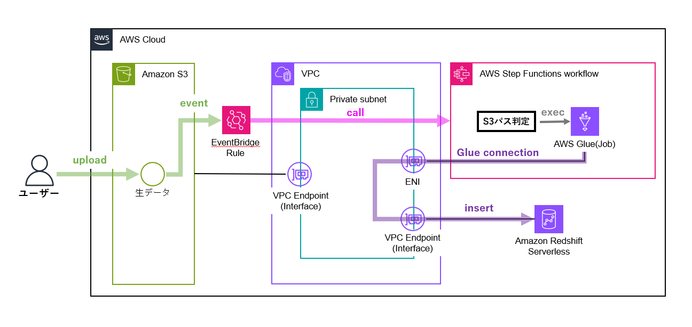
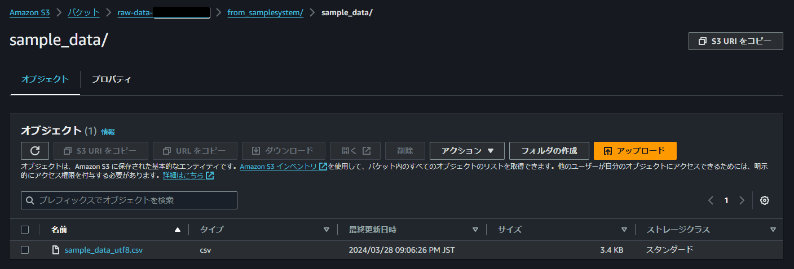
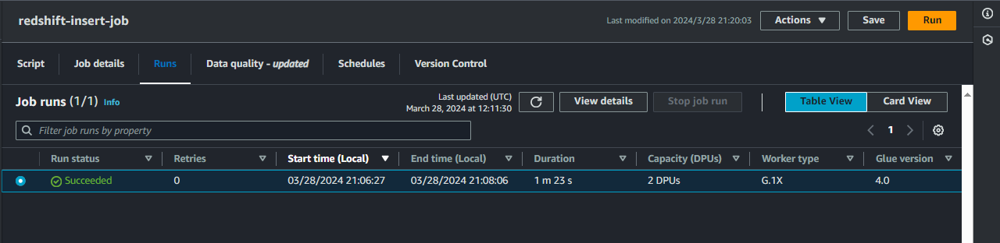
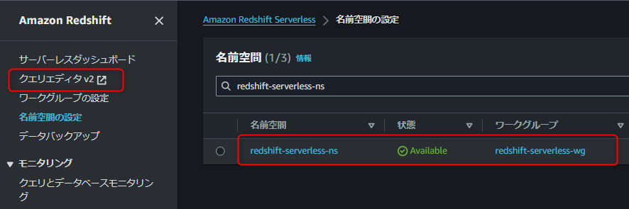
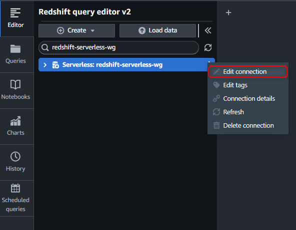
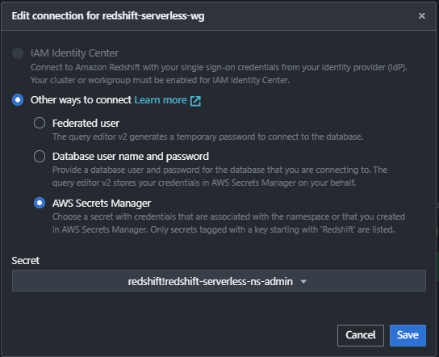
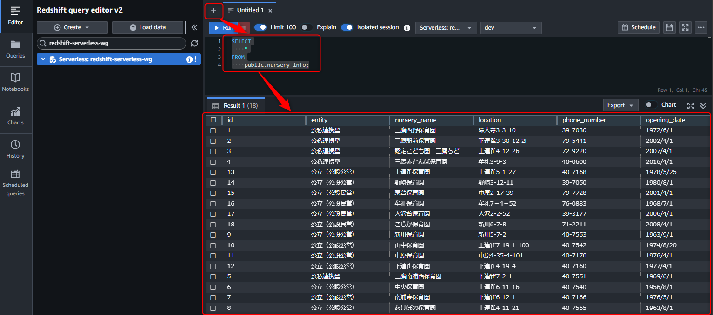

# glue-redshift-pipeline
S3アップロードを起因として、GlueJobからRedshift Serverlessに直接データをインサートするサンプルパイプラインをデプロイするためのリポジトリです。


# 注意事項
本リポジトリでのデプロイ手順は後述する検証環境で行っています。<br>
極力環境依存の手順は減らすようにしてはいますが、必要に応じて読み替えてご実施ください。


# サンプルデータ
東京都が公開している以下のオープンデータを使用します。<br>
Glue Jobでの取り込みのために事前にUTF-8への文字コード変換を実施済みです。

- [令和６年度認可保育園等一覧（公立・公私連携）](https://catalog.data.metro.tokyo.lg.jp/dataset/t132047d0000000013/resource/1d98fdef-39ac-4e64-a96f-51b63c9907a0)


# 構成図
本リポジトリでは以下のようなアーキテクチャが構築されます。




# 検証環境
- 検証時の環境バージョンは以下です。
  - WSL バージョン: 2.1.5.0
  - カーネル バージョン: 5.15.146.1-2
  - Windows バージョン: 10.0.19045.4170
  - Docker version 24.0.6, build ed223bc
  - aws-vault 7.2.0-Homebrew

# 前提条件
- デプロイに必要な1つのVPCと3AZ分のSubnetは既に作成されているものとします。
- 以下のツール群が既にインストールされているものとします。
  - docker((参考URL)[https://zenn.dev/thyt_lab/articles/fee07c278fcaa8])
  - aws-vault((参考URL)[https://qiita.com/tawara_/items/b993815a1bdc3789a3ff])
    - MFA設定している方は(MFA設定)[https://qiita.com/ezaqiita/items/335faf2c122ebd90b6a4]も忘れず
- AWSのアクセスキー、シークレットアクセスキーを事前に作成され、利用可能な状態になっているものとします。

※今回はDockerとaws-vaultを使用してコンテナ上でterraformコマンドを実行するようにして、ローカルでのTerraformインストールを不要にしました。<br>

# デプロイ手順
## aws-vault設定
最初にAWSの認証情報を登録します。<br>
[プロファイル名]には自身がわかりやすいプロファイル名を設定してください。

```
$ aws-vault --version
$ aws-vault add [プロファイル名]

Enter Access Key ID: 
Enter Secret Access Key:
```

設定した後に.awsフォルダ配下のconfigファイルを確認すると以下のように表示されると思います。

```
$ cat ~/.aws/config

[default]
region=ap-northeast-1
output=json

[プロファイル名]
```

viコマンドなどを使用してconfigファイルを以下のように修正してください。<br>
mfa_serialにはご自身のものを設定してください。

```
$ cat ~/.aws/config

[default]
region=ap-northeast-1
output=json

[プロファイル名]
region=ap-northeast-1
output=json
mfa_serial=arn:aws:iam::123456789123:mfa/xxxxxxxx　※MFA設定している人のみ
```

## デプロイ実施
リポジトリからソースコードを取得します。

```
$ git clone [Clone URL]
$ cd glue-redshift-pipeline
```

デプロイコマンドを実行する前にaws-vaultを呼び出してAWSの一時的な認証情報を取得・設定します。

```
$ aws-vault exec [プロファイル名]

Enter MFA code for arn:aws:iam::123456789123:mfa/xxxxxxxx: 111111　※MFA設定している人のみ
Starting subshell /bin/bash, use `exit` to exit the subshell
```

エラーなく実行出来たら以下のコマンドを実行し、トークンの有効期限を確認します。

```
$ aws-vault list

Profile                  Credentials              Sessions
=======                  ===========              ========
default                  -                        -
[プロファイル名]          [プロファイル名]         sts.GetSessionToken:58m49s
```

本リポジトリのリソースは1つのVPCと3つのSubnetを利用するため、デプロイ先の環境のリソースIDに置き換えて以下を実行します。

```
$ export vpc_id=vpc-xxxxxxxxxxxxxxxxx
$ export subnet_private_1a_id=subnet-xxxxxxxxxxxxxxxxx
$ export subnet_private_1c_id=subnet-xxxxxxxxxxxxxxxxx
$ export subnet_private_1d_id=subnet-xxxxxxxxxxxxxxxxx
```

後は以下のコマンドを実行するだけです。<br>
applyまで実行すればデプロイ先の環境に構築されていると思います。

```
$ docker compose run --rm terraform init
$ docker compose run --rm terraform plan
$ docker compose run --rm terraform apply
$ docker compose run --rm terraform destroy
$ docker compose run --rm terraform apply -refresh-only
```

## デプロイ後確認
正常にデプロイされたら、「raw-data-[accountid]」バケットの「from_samplesystem/sample_data/」プレフィックスにサンプルファイルが自動でアップロードされているはずです。



アップロードイベントによってEventBridgeからSrepFunctionsが実行され、Glue Jobが実行されます。<br>
Glue Jobは大体1分半ぐらいで終了します。<br>
※もし実行されてなければ、上記のS3上のファイルをダウンロードして、同じ場所に再アップロードしてください



Glue Jobが正常終了していれば、Redshift Serverlessにデータが追加されているはずなので、クエリを実行して確認します。<br>
Redshift Serverlessが作成されていることを確認し、クエリエディタv2を開きます。



構築したRedshift Serverless名を選択して、「Edit connection」からクエリエディタ上での接続情報設定を行います。<br>
今回は構築時にSecrets Managerで管理ユーザーの認証情報を管理するように設定しているため、「AWS Secrets Manager」を選択します。




「＋」からEditorを開いて、以下のSQLを実行するとサンプルデータが取得されることが確認できます。



```
SELECT
    *
FROM
    public.nursery_info;
```

あとは自由にデータを変えてみたり変換処理を追加してみたりして遊んでみてください。

# 参考URL
- [AWSのIaCでTerraformを使う際の環境設定ベストプラクティス(AWSマルチアカウント対応)](https://zenn.dev/himekoh/articles/202209021116)
